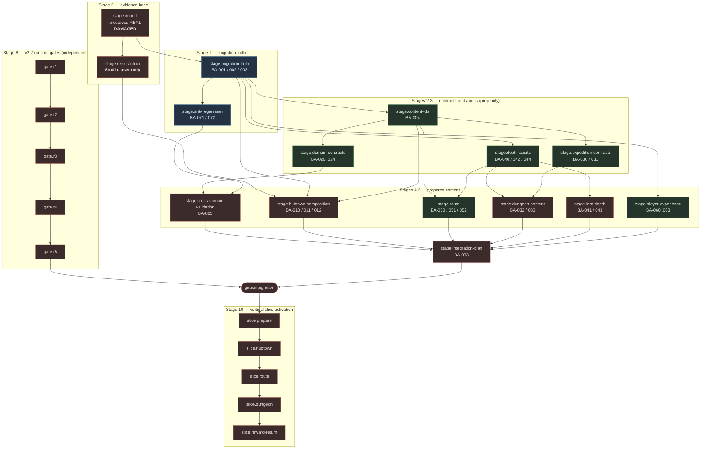

# Combined-Game Integration Dependency Graph — BA-070

**Task:** BA-070 (build-ahead lane, P7 integration planning)
**Machine-readable source of truth:** [`combined-game-integration-graph.json`](combined-game-integration-graph.json)
**Evidence level:** source-proven only. No Studio or runtime evidence is claimed.
**Runtime posture:** inert. This graph orders work; it authorizes nothing.

26 nodes, validated in CI: every node resolves its dependencies, every
referenced build-ahead task exists in the queue, every referenced manifest entry
exists in a manifest, every named canonical module exists on disk, and the graph
is acyclic.

## The shape of the problem

## The two lanes never touch until one node

`gate.integration` is the only node where preparation becomes activation, and it
requires **both** halves: the v2.7 runtime gates closed out through R5, and the
BA-073 integration plan in place. Every Lane B node above it can be completed,
reviewed and merged while evidence stays at E1.

That is deliberate. `gate.r1` has no dependency on any preparation node, and no
preparation node depends on a runtime gate. Preparation never waits on Studio,
and it never bypasses it.

## Stage order

| Stage | Node | Gate | Status |
|---|---|---|---|
| 0 | `stage.import` | none | **DAMAGED** — 17/28 sources, 122/1,775 rows |
| 0 | `stage.reextraction` | studio-extraction | **REQUIRED, NOT STARTED** — user action |
| 1 | `stage.migration-truth` | none | **DONE** (BA-002 partial) |
| 1 | `stage.anti-regression` | none | **DONE** |
| 2 | `stage.content-ids` | prep-only | READY |
| 3 | `stage.domain-contracts` | prep-only | READY |
| 3 | `stage.expedition-contracts` | prep-only | READY |
| 3 | `stage.depth-audits` | none | READY |
| 4 | `stage.cross-domain-validation` | none | blocked on domain contracts |
| 5 | `stage.hubtown-composition` | studio-extraction | **blocked externally** |
| 5 | `stage.route` | prep-only | READY |
| 6 | `stage.dungeon-content` | prep-only | blocked on expedition contracts |
| 6 | `stage.loot-depth` | prep-only | blocked on depth audits |
| 6 | `stage.player-experience` | prep-only | READY |
| 7 | `stage.integration-plan` | none | blocked on the subsets it sequences |
| 8 | `gate.r1` … `gate.r5` | v2.7-R1…R5 | OPEN, evidence remains E1 |
| 9 | `gate.integration` | integration | blocked |
| 10 | `slice.prepare` → `slice.reward-return` | integration | blocked |

## What the graph makes visible

**1. Only one node is externally blocked, and it is contained.**
`stage.reextraction` needs the source place in Studio and no agent can advance
it. It gates `stage.hubtown-composition` — and therefore `slice.hubtown` and
everything after it — but nothing else. The graph routes `stage.route`,
`stage.player-experience` and every contract and audit stage around it on
purpose, so the external blocker costs one branch rather than the whole lane.

**2. Anti-regression sits at stage 1, before any content exists.** BA-071 and
BA-072 come before the contracts they protect, because each later stage adds
content that could reintroduce a second authority path or a broken reference.
Guards written after the content they guard tend to be written to pass.

**3. Lighting and VFX migration is downstream of R4, not of HubTown.** Every
`REPLACE` lighting entry in the BA-001 and BA-002 manifests — torches, orbs,
crystals, glow ring, ground fog, fireflies, clouds — lands after
`gate.r4`. Migrating legacy emissive parts before presentation ownership is
centralized would reintroduce precisely the escaped-Highlight incident R4 exists
to close.

**4. `slice.hubtown` carries the heaviest dependency in the graph.** It needs
the integration gate, the domain contracts, and `stage.reextraction`
transitively. If the vertical slice needs to ship before re-extraction happens,
the hub is the piece to cut or stub — not the route or the dungeon.

**5. The reward/return beat is nearly free.** `ExpeditionResultService`,
`ExpeditionRewardDistributionService` and `ExpeditionPartyDecisionService`
already exist with fixture coverage. `slice.reward-return` wires prepared
content into them rather than building anything.

## Recommended order for the next agent run

Everything at stage ≤ 3 that is READY, in this order:

1. `BA-004` — content ids and contracts (unblocks the most)
2. `BA-040`, `BA-042`, `BA-044` — depth audits (docs/data, no dependencies)
3. `BA-020`, `BA-022`, `BA-023`, `BA-024`, `BA-021` — domain contracts
4. `BA-030`, `BA-031` — expedition and portal contracts
5. `BA-060`, `BA-061`, `BA-063` — player experience
6. `BA-050`, `BA-052` — route and discovery, against canonical landmarks
7. `BA-025` — cross-domain validation, once the contracts land

`BA-010`/`011`/`012` stay parked until re-extraction, except for the
art-direction decision BA-010 owes, which is not blocked and should be made
early because it changes what HubTown migration even means.
